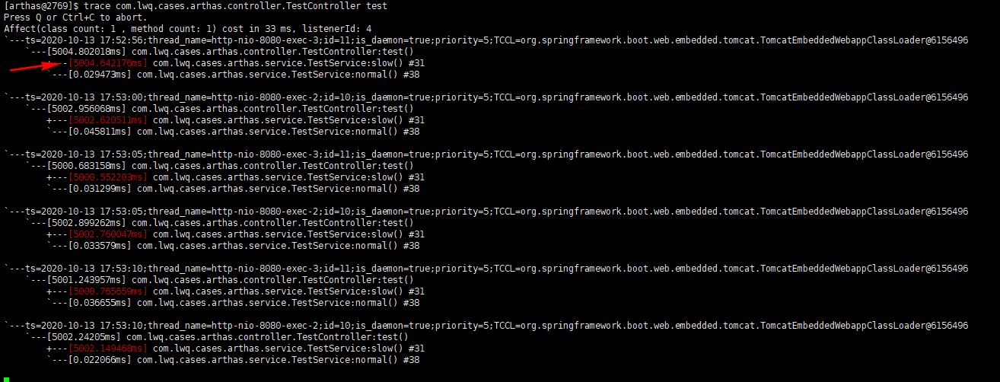
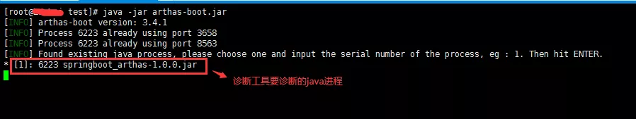
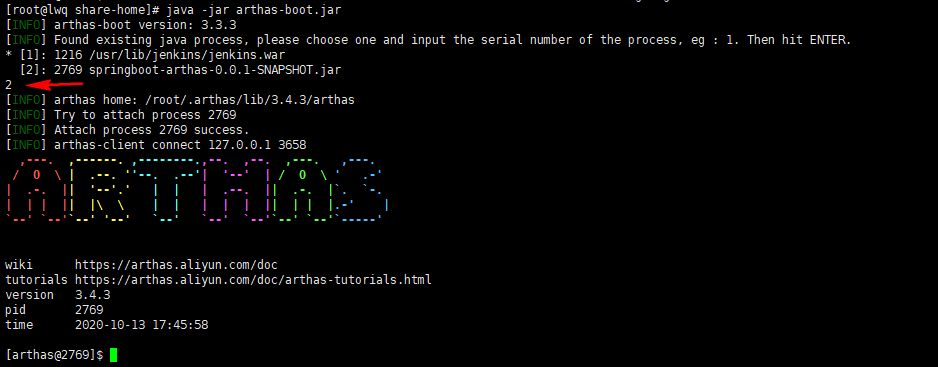

## 说明
- 定义接口，模拟耗时操作，[TestController](./src/main/java/com/lwq/cases/arthas/controller/TestController.java)
- 利用Jmeter测试耗时接口，Jmeter脚本见 [jmeter调用test接口.jmx](./src/main/resources/jmeter调用test接口.jmx)
- 利用Arthas trace命令找到耗时的操作

结果：

分析：

通过trace 命令监控统计的调用链路各个方法的执行耗时，可以发现调用的 com.lwq.cases.arthas.service.TestService 类中的 slow() 方法执行耗时比较大；所以需要特别去查看这个方法的代码是否存在问题；如果这个代码中还存在许多的方法调用链路，则需要再次使用 trace 命令进行监控调用链路的耗时，找出具体可能存在问题的方法。

注意：

①、使用Arthas 诊断的程序代码，在打包时 不能混淆 ，否则在使用trace 命令会报  类或方法找不到  ；

②、在使用trace命令监控统计时，需要JMeter测试脚本正在运行调用服务接口，如果没有调用，则统计不到内部调用链路的耗时情况；

## 附录
**Arthas trace 使用：**

1、首先需要下载阿里开源的Arthas 的诊断工具 Jar 包，下载地址：https://arthas.aliyun.com/arthas-boot.jar ；然后将 Jar 包放到 部署服务接口项目的服务器中 。

2、运行要诊断的程序，本例为：`springboot-arthas-0.0.1-SNAPSHOT.jar`

3、然后运行Arthas 诊断工具，命令：java  -jar  arthas-boot.jar ；开始运行的界面如图：

此时诊断工具还没有运行完，需要手动选择要诊断/监控的java 进程，并且此工具也会列出全部的java进程号，选择要监控的程序的序号即可 即可；如图：

4、运行完后，可以使用 trace命令 监控服务接口方法中调用的其它方法的耗时；

trace 命令能主动搜索 class-pattern／method-pattern 对应的方法调用路径，渲染和统计整个调用链路上的所有性能开销和追踪调用链路。

具体命令格式：trace  [全限定类名][类中的方法名]

例如：监控本服务接口：

com.lwq.cases.arthas.controller.TestController : 全限定类名，test：TestController 类中的方法；

具体命令： trace `trace com.lwq.cases.arthas.controller.TestController test`

5、trace 命令执行结果展示，如图一。
