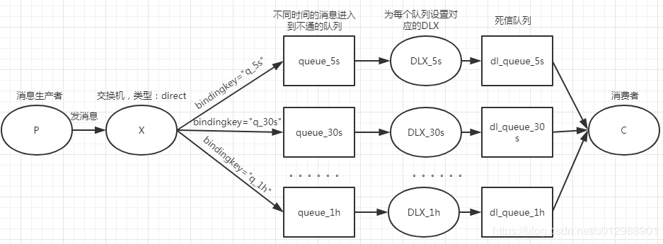
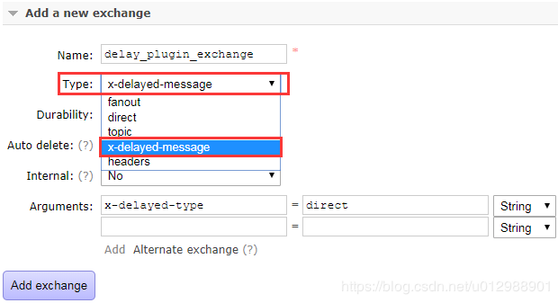

# Rabbitmq实现延时队列
两种方式
- TTL+DLX（即消息有效期+死信交换机/队列）
- rabbitmq-delayed-message-exchange插件。

## 延时消息
延迟队列是存储延迟消息的队列，延迟消息就是生产者发送了一条消息，但是不希望该消息不要被立即消费，而是设置一个延迟时间，等过了这个时间再消费消息。

延迟队列常见的使用场景如下：

- 电商系统中经常会有下订单超过多长时间不支付会自动关闭，这个就可以通过延迟队列来实现：创建订单时发送一条消息到队列并设置有效期，消息到达有效期后消费该消息，判断订单是否支付，如果未支付则把订单置为超时关闭状态；
- 现在智能家居比较流行，通常都可以用手机远程遥控，比如在回家之前定时在半小时后把空调打开，这个也可以通过延迟队列做，开机指令在到达设定时间后推送给家电进行操作；
- 第三方支付系统的异步阶段性通知：我们接入第三方支付系统的小伙伴对notify_url这个字段应该都很熟悉，这个是我们接收第三方支付系统支付/退款成功等通知的地址，如果商户收到第三方支付的通知后响应的不是处理成功的话，后续第三方支付系统会按照越来越大的时间间隔去继续通知商户系统（比如5秒、30秒、5分钟、1小时、6小时、12小时。。。。。。），这个也是可以通过延迟队列实现的。
- 。。。。。。

其他方式

解决上述场景的方法，除了使用延迟队列之外，一般还有如下两种：

- 定时任务：比如订单有效期30分钟，起一个定时任务，每次扫描创建时间大于30分钟的未支付订单，然后把这些订单关闭掉。优点是实现简单；缺点会有延迟，而且定时任务执行的间隔越长延迟越高，还会重复扫描数据，数据量太大的话会很慢，效率也比较低。
- java.util.concurrent.DelayQueue：java并发包中提供了一个DelayQueue，是一个无界的BlockingQueue，用于放置实现了Delayed
接口的对象，其中的对象只能在其到期时才能从队列中取走。这种队列是有序的，即队头对象的延迟到期时间最长。我们可以将订单相关信息放到DelayQueue，消费者线程监听DelayQueue从中取出过期的订单，然后做相应的操作。优点是比纯定时任务扫描效率会提高很多，因为不用重复扫描数据表了。缺点是数据量大的话DelayQueue的消费者需要起更多的线程，而创建线程很耗费服务器资源，数据是放入内存中的，重启后队列数据会清空（可以结合定时任务，但是集群环境多机部署时要考虑数据分布问题），如果感兴趣的话可以查阅资料看看它是如何使用的。

## 使用TTL+DLX实现延迟队列
这种方案就是给消息设置有效期，并给消息所在队列设置DLX（死信交换机），当消息过期后变为死信消息然后被发送到DLX中，然后根据死信的路由键路由到DLX上绑定的死信队列上面。

实际应用中，我们都会按照时间段划分等级，例如为5 秒、30 秒、5 分钟、30 分钟、1 小时。。。。。。如下图，我们只画了三个队列，中间的时间省略了。生产者发消息时携带有时间标识的路由键，然后交换机将消息路由到对应的消息过期时间的队列上，这些队列分别绑定了死信交换机，这些死信交换机又分别绑定了死信队列，消息过期后就通过死信交换机路由到了死信队列上面，然后我们的消费者就可以监听消费死信队列上面的消息了。

注意：下面图示中多个死信交换机分别绑定了队列，这样是为了更好的区分不同时间的消息，方便处理、查看、统计、监控等，当然也可以多个死信交换机绑定同一个队列。


## 使用插件实现延迟队列
上面演示了通过TTL+DLX实现的延迟队列，这样分的时间段越多，需要的交换机及队列也越多。前面的方式实现起来有点复杂，其实有更简单的实现方式，在RabbitMQ 3.5.7及以上的版本提供了一个插件（rabbitmq-delayed-message-exchange）来实现延迟队列功能。同时插件依赖Erlang/OPT 18.0及以上。

**注意：** 使用rabbitmq-delayed-message-exchange插件时发送到队列的消息数量在web管理界面不可见，不影响正常功能使用

### 插件下载安装
插件源码地址：https://github.com/rabbitmq/rabbitmq-delayed-message-exchange，插件下载地址为：https://bintray.com/rabbitmq/community-plugins/rabbitmq_delayed_message_exchange，进去之后可以看到如下图的界面，可以选择对应的版本进行下载

下载完成后，进入到我们的RabbitMQ的安装目录，把插件放入plugins目录下面， 然后可以通过如下命令管理该插件

- 启用插件：rabbitmq-plugins enable rabbitmq_delayed_message_exchange
- 关闭插件：rabbitmq-plugins disable rabbitmq_delayed_message_exchange

### 插件使用介绍
我们启用该插件之后，可以登上web管理台，在添加交换机时可以看到多了一个x-delayed-message类型，而这个类型是rabbitmq_delayed_message_exchange插件提供的，RabbitMQ自己是没有的，可以通过x-delayed-type参数设置fanout /direct / topic / header 类型。

声明x-delayed-message类型的交换机代码如下所示：
```
Map<String, Object> args = new HashMap<String, Object>();
args.put("x-delayed-type", "direct");
channel.exchangeDeclare("delay_plugin_exchange", "x-delayed-message", true, false, args);
```
发送消息的时候通过header添加"x-delay"参数来设置消息的延时时间，其单位为毫秒
```
Map<String, Object> headers = new HashMap<String, Object>();
headers.put("x-delay", 5000);
BasicProperties props = new AMQP.BasicProperties.Builder()
	                .headers(headers).build();
channel.basicPublish("delay_plugin_exchange", "delay", props , "延迟消息".getBytes());
```
### 代码说明
偶数序号消息延迟五秒，奇数序号延迟两秒
