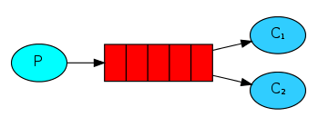
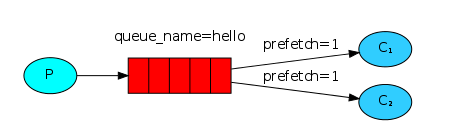

## 工作队列 （work queue）
一个生产者，多个消费者

- 虽然消费者2比消费者1处理的快得多，但是还是收到的消息数量跟消费者1一样。
仔细观察消息后面的数字，发现奇数消息发给了消费者1，偶数消息发给了消费者，是循环交替分发的。
通过查看官网资料，我们知道RabbitMQ默认是通过 Round-robin dispatching 方式进行消息分发的，
RabbitMQ将按顺序将每条消息发送给下一个消费者，它不会查看消费者未确认消息的数量。
平均而言，每个消费者将获得相同数量的消息，这种分发消息的方式称为round-robin（循环法）。
- 上面我们知道了RabbitMQ默认是 round-robin 分发的，但这种方式是不合理的，
正常情况应该是消费者处理的快了应该多分发一些消息，处理慢了应该少分发一些。
我们可以使用 basicQos 方法和 prefetchCount = 1 设置。这告诉RabbitMQ一次向一个worker发送一条消息。
或者，换句话说，在处理并确认前一个消息之前，不要向worker发送新消息。
注意这里消息的ack确认模式必须要为手动，channel.basicQos()方法才会起作用。

