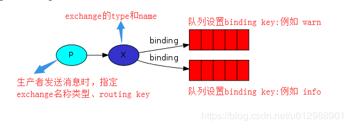

## exchange
### 交换机原理
我们之前的例子当中，将exchange的名字设为了空字符串，貌似都是将消息直接发送给了Queue，实际上也是发送给了交换机的，只不过这个exchange的名字是个空字符串，是RabbitMQ的默认的交换机。RabbitMQ
中消息传递模型的核心思想是生产者永远不会将任何消息直接发送到队列。实际上，生产者通常甚至不知道消息是否会被传递到任何队列。

生产者发送消息时指定交换机名称、类型和routing key，消息发送到指定的交换机之后，exchange会根据交换机类型和routing key将消息路由到绑定的队列上面。

### 交换机类型

交换机主要包括如下4种类型：

#### 1. Fanout exchange（扇型交换机）
fanout类型的Exchange路由规则非常简单，它会把所有发送到该Exchange的消息路由到所有与它绑定的Queue中，所以此时routing key是不起作用的。
#### 2. Direct exchange（直连交换机）
direct类型的Exchange路由规则也很简单，它会把消息路由到那些binding key与routing key完全匹配的Queue中。
  
#### 3. Topic exchange（主题交换机）
前面讲到direct类型的Exchange路由规则是完全匹配binding key与routing key，但这种严格的匹配方式在很多情况下不能满足实际业务需求。topic类型的Exchange在匹配规则上进行了扩展，它与direct类型的Exchage相似，也是将消息路由到binding key与routing key相匹配的Queue中，但这里的匹配规则有些不同，它约定：
- routing key为一个句点号“. ”分隔的字符串（我们将被句点号“. ”分隔开的每一段独立的字符串称为一个单词），如“stock.usd.nyse”、“nyse.vmw”、“quick.orange.rabbit”
- binding key与routing key一样也是句点号“. ”分隔的字符串
- binding key中可以存在两种特殊字符“*”与“#”，用于做模糊匹配，其中“*”用于匹配一个单词，“#”用于匹配多个单词（可以是零个）

#### 4. Headers exchange（头交换机）
headers类型的Exchange不依赖于routing key与binding key的匹配规则来路由消息，而是根据发送的消息内容中的headers属性进行匹配。

在绑定Queue与Exchange时指定一组键值对；当消息发送到Exchange时，RabbitMQ会取到该消息的headers（也是一个键值对的形式），对比其中的键值对是否完全匹配Queue与Exchange绑定时指定的键值对；如果完全匹配则消息会路由到该Queue，否则不会路由到该Queue。

#### 5.其他交换机
另外RabbitMQ默认定义一些交换机：默认匿名交换机、amq.* exchanges。还有一类特殊的交换机：Dead Letter Exchange（死信交换机）

##### 1. 默认匿名交换机（default exchange）：
实际上是一个由RabbitMQ预先声明好的名字为空字符串的直连交换机（direct exchange），所以我们前面发送消息时设置的exchange的name
都是空字符串。它有一个特殊的属性使得它对于简单应用特别有用处：那就是每个新建队列（queue）都会自动绑定到默认交换机上，绑定的路由键（routing key）名称与队列名称相同。如：当你声明了一个名为”hello_queue”的队列，RabbitMQ会自动将其绑定到默认交换机上，绑定（binding）的路由键名称也是为”hello_queue”。因此，当携带着名为”hello_queue”的路由键的消息被发送到默认交换机的时候，此消息会被默认交换机路由至名为”hello_queue”的队列中。即默认交换机看起来貌似能够直接将消息投递给队列。

例如我们之前用 channel.basicPublish("", “hello_queue”, null, message.getBytes()) 的方式发送消息，空字符串就是默认匿名交换机的名称， hello_queue就是routing key。

##### 2. 类似amq.*的名称的交换机：
这些是RabbitMQ默认创建的交换机。这些队列名称被预留做RabbitMQ内部使用，不能被应用使用，否则抛出403 (ACCESS_REFUSED)错误

可以通过查看控制台 AMQP default 交换机详情中的binding，看到对应的说明，也可以通过命令行`rabbitmqctl list_exchanges`

##### 3. Dead Letter Exchange（死信交换机）：
在默认情况，如果消息在投递到交换机时，交换机发现此消息没有匹配的队列，则这个消息将被悄悄丢弃。为了解决这个问题，RabbitMQ中有一种交换机叫死信交换机。当消费者不能处理接收到的消息时，将这个消息重新发布到另外一个队列中，等待重试或者人工干预。这个过程中的exchange和queue就是所谓的”Dead Letter Exchange 和 Queue”。

### 代码说明 fanout类型的exchange实现发布/订阅模式
这节我们先介绍一下fanout类型的交换机，实现一下Publish/Subscribe（发布订阅）的效果，即一条消息发送给多个消费者，之前的work queues都是只发送给一个消费者。
消息发送者代码，我们可以看到生产者只是声明了交换机，然后将消息发送到了交换机中，整个过程当中并没有设置队列相关的参数。

