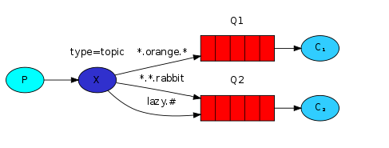

# topic exchange
发送到topic交换机的消息不能具有任意的  routing_key —— 它必须是由点分隔的单词列表。单词可以是任何内容，但通常它们指定与消息相关的一些功能。一些有效的路由键示例：“ stock.usd.nyse ”，“ nyse.vmw ”，“ quick.orange.rabbit ”。其中可以包含任意数量的单词，最多可达255个字节。

binding key也必须采用相同的形式。topic交换机背后的逻辑 类似于direct交换机——使用特定 routing key 发送的消息将被传递到与匹配binding key绑定的所有队列。但是binding key有两个重要的特殊情况：

*（星号）可以替代一个单词。
＃（hash）可以替换零个或多个单词。
在一个例子中解释这个是最容易的：

我们准备发送关于动物的消息。消息会附加一个选择键包含3个标识符（两个点隔开）。第一个标识符描述动物的速度，第二个标识符描述动物的颜色，第三个标识符描述动物的物种：<speed>.<color>.<species>。

我们创建3个绑定键：Q1与*.orange.*绑定Q2与*.*.rabbit和lazy.#绑定。可以概括为：

- Q1对所有的橙色动物感兴趣。

- Q2想要知道关于兔子的一切以及关于懒洋洋的动物的一切。

一个附带quick.orange.rabbit的选择键的消息将会被转发到两个队列。附带lazy.orange.elephant的消息也会被转发到两个队列。另一方面quick.orange.fox只会被转发到Q1，lazy.brown.fox将会被转发到Q2。lazy.pink.rabbit虽然与两个绑定键匹配，但是也只会被转发到Q2一次。quick.brown.fox不能与任何绑定键匹配，所以会被丢弃。

如果我们违法我们的约定，发送一个或者四个标识符的选择键，类似：orange，quick.orange.male.rabbit，这些选择键不能与任何绑定键匹配，所以消息将会被丢弃。

另一方面，lazy.orange.male.rabbit，虽然是四个标识符，也可以与lazy.#匹配，从而转发至Q2。

`注意:`主题类型的转发器非常强大，可以实现其他类型的转发器。

- 当一个队列与绑定键#绑定，将会收到所有的消息，类似fanout类型转发器。

- 当绑定键中不包含任何#与*时，类似direct类型转发器。

## 代码说明
生产者的routing key会从数组{ "order.info", "order.warn.middle", "order.error.high" ,"user.info" }中随机选择一个，
消费者1的binding key为"*.info"，则如果发送的消息的routing key 以一个单词开头以info结尾（中间以"."分隔）会路由到消费者1；
消费者2的binding key为"order.#"，则如果发送的消息的routing key 如果以order开头都会路由到消费者2。

