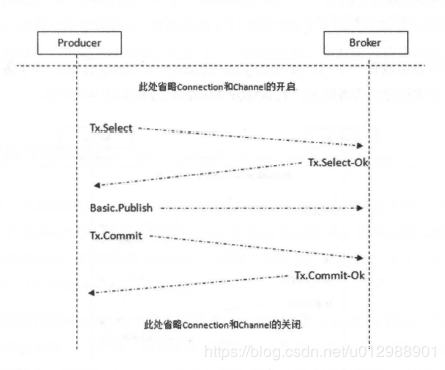

# RabbitMQ的生产者确认的两种模式：事务与confirm机制

## 概述
我们上一节介绍了RabbitMQ的事务机制，在RabbitMQ broker因为某些原因崩溃、重启时，可以确保消息不会丢失。
但是我们发送完消息之后，并不知道消息有没有真的发到了RabbitMQ服务器上并存储完毕，如果因为网络闪断等原因导致消息没有发到服务器上，或者RabbitMQ服务器发生内部错误导致持久化失败，这样就会导致消息丢失。针对生产者发送消息的确认问题，RabbitMQ提供了如下两种方式（注意：事务机制跟confirm机制两者是互斥的，如果已经开启了其中一种，再去开启另外一种会报错的）

1.通过事务机制

2.通过发送方确认机制，即publish confirm模式，又可以细分为三种：单条confirm模式、批量confirm模式、异步confirm模式

注意：事务机制和publisher confirm 机制确保的是消息能够正确地发送至RabbitMQ的交换机，如果此交换机没有匹配的队列，那么消息也会丢失，
并且生产者都会收到发送成功的消息（事务机制会返回Tx.Commit-OK，confirm机制会返回Basic.Ack）。如果想知道消息到底有没有路由到队列里面，发送消息时要结合mandatory 参数和ReturnListener（关于mandatory 参数和生产者的return机制下一节会介绍）。 

## 效率
效率从低到高为： 事务模式 < 单条confirm模式 < 批量confirm模式 < 异步confirm模式。

说明：单条confirm模式比事务模式效率仅高一点，批量confirm要比单条confirm的效率高很多，异步confirm模式要比批量confirm模式高一些，自己可以实际压测验证一下。

## 事务机制

提起事务，想必大家都很熟悉，在我们使用关系型数据库的时候经常使用事务，使用方法一般都是：先开启事务，然后操作数据，操作数据完成提交事务，如果操作失败进行事务的回滚。

RabbitMQ的事务机制操作过程跟上面的有点类似，主要有三个方法：

channel.txSelect() 用于开启事务
channel.txCommit() 用于提交事务
channel.txRollback() 用于回滚事务
一般使用方式如下（关于事务机制下面已经给出关键，就不再单独贴完整的示例了，可以通过异常测试事务回滚的情况）

RabbitMQ的事务机制操作流程图示如下：

事务机制主要有如下步骤：

1.客户端发送Tx.Select. 将信道置为事务模式;

2.Broker 回复Tx. Select-Ok. 确认己将信道置为事务模式;

3.在发送完消息之后，客户端发送Tx.Commit 提交事务;

4.Broker 回复Tx. Commit-Ok. 确认事务提交。

上面是事务可以正常提交的流程图，如果出现异常，则上面的步骤3和4变更为：客户端发送Tx.Rollback，Broker回复Tx.Rollback-OK。

注意：代码示例中basicPublish方法中修改routing key为错误的参数，这时消息无法正确路由到队列上也会丢失，但是事务仍然可以提交成功，这也印证了我们上面所介绍的。只有消息被成功发送到RabbitMQ的交换机后事务才能够提交，否则捕获异常回滚事务，回滚事务之后也可以继续重发消息。事务机制是阻塞的，发送消息之后要一直等待RabbitMQ的回应，否则就无法发送下一条，其效率是最低的，不建议使用。

