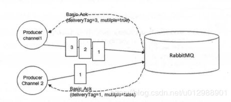

# 发送方确认机制
我们上面介绍了事务机制，但是效率太低了。RabbitMQ还提供了一种生产者确认（publisher confirm）的模式，消息生产者可以通过 channel.confirmSelect() 方法把channel开启confirm模式，通过confirm模式的channel发布的消息都会指定一个唯一的消息ID（也就是deliveryTag，从1开始递增）。消息被发到RabbitMQ后，RabbitMQ会给生产者发送消息，消息内容有：发送消息时传递过去的deliveryTag；一个标志Ack/Nack（Ack表示成功发到了RabbitMQ交换机上，Nack表示发送失败）；还有一个multiple参数表示是否是批量确认，如果为false则表示单条确认，如果为true则表示到这个序号之前的所有消息都己经得到了处理。如果发送的是持久化消息，则在消息被成功写入磁盘之后才会发送给生产者确认消息。


事务模式吞吐量较低的原因是生产者每发送一条消息只能同步等待事务提交，然后才可以发送下一条。而confirm机制可以异步的处理，在生产者发送一条消息之后，可以在等RabbitMQ发送确认消息同时继续发送消息。RabbitMQ收到消息之后会发送一条Ack消息；如果消息服务器出现内部错误等原因导致消息丢失，会发送一条Nack消息。

注意：极少会出现nack的情况，一般都会返回ack的。要注意区分一下这里的ack跟上一节消费者消费消息时的ack，不要搞混了，消费者ack是表示消费者消费消息成功了，生产者收到RabbitMQ的ack表示生产者的消息成功投递到了RabbitMQ上了。

生产者confirm模式使用方式总共有三种： 单条confirm模式、批量confirm模式、异步confirm模式，这三种模式的开启方法都是 channel.confirmSelect()。

## 单条confirm
单条confirm模式就是发送一条等待确认一条，使用方式如下：在每发送一条消息就调用channel.waitForConfirms()方法，该方法等待直到自上次调用以来发布的所有消息都已被ack或nack，如果返回false表示消息投递失败，如果返回true表示消息投递成功。注意，如果当前信道没有开启confirm模式，调用waitforconfirms将引发IllegalstateException。
```
channel.confirmSelect();//将信道置为confirm模式
String message = "单条confirm消息";
channel.basicPublish(EXCHANGE_NAME, "", MessageProperties.PERSISTENT_TEXT_PLAIN, message.getBytes());
if(!channel.waitForConfirms()){
    System.out.println("消息发送失败");
    //进行重发等操作
}
System.out.println("消息发送成功");
```
另外，我们在上面说过"单条confirm模式的效率仅比事务模式高一点"，这是为什么呢？其实通过上面的代码我们也看到了，单条confirm模式其实也是阻塞的，只不过它比事务模式少发了一个指令（事务机制发完消息之后要提交事务，然后等待RabbitMQ返回事务提交成功的消息；confirm模式发完消息后等待RabbitMQ的Ack）。

## 批量confirm
批量confirm模式就是先开启confirm模式，发送多条之后再调用waitForConfirms()方法确认，这样发送多条之后才会等待一次确认消息，效率比单条confirm模式高了许多。但是如果返回false或者超时，这一批次的消息就要全部重发，如果经常丢消息，效率并不比单条confirm高。。。。。。
```
channel.confirmSelect();//将信道置为confirm模式
for(int i=0;i<5;i++){
	String message = "批量confirm消息"+i;
	channel.basicPublish(EXCHANGE_NAME, "", MessageProperties.PERSISTENT_TEXT_PLAIN, message.getBytes());
}
if(!channel.waitForConfirms()){
	System.out.println("消息发送失败");
	//进行重发等操作
}
System.out.println("消息发送成功");
```

## 异步confirm
异步confirm模式是通过channel.addConfirmListener(ConfirmListener listener)方式实现的，ConfirmListener中提供了两个方法handleAck(long deliveryTag, boolean multiple) 和 handleNack(long deliveryTag, boolean multiple)，两者分别对应RabbitMQ发送给生产者的ack和nack。方法中的deliveryTag就是上面说的发送消息的序号；multiple参数表示是否是批量确认。

异步confirm模式使用起来最为复杂，因为要自己维护一个已发送消息序号的集合，当收到RabbitMQ的confirm回调时需要从集合中删除对应的消息（multiple为false则删除一条，为true则删除多条），上面我们说过开启confirm模式后，channel上发送消息都会附带一个从1开始递增的deliveryTag序号，所以我们可以使用SortedSet的有序特性来维护这个发送序号集合：每次获取发送消息的序号存入集合，当收到ack时，如果multiple为false，则从集合中删除当前deliveryTag元素，如果multiple为true，则将集合中小于等于当前序号deliveryTag元素的集合清除，表示这批序号的消息都已经被ack了；nack的处理逻辑与此类似，只不过要结合具体的业务情况进行消息重发等操作。

其实RabbitMQ的java客户端就是用的SortedSet集合处理的，具体的可以查看com.rabbitmq.client.impl.ChannelN 这个类的代码

## 代码说明
多运行几次，可能每次都会不一样，你也可以尝试将发送消息总数改为50或者更多，然后多运行几次观察结果。
通过运行结果发现：单个或者批量确认，貌似是随机的。。。。。。发送的消息条数越多，批量确认的次数越多，毕竟批量确认效率更高嘛。
