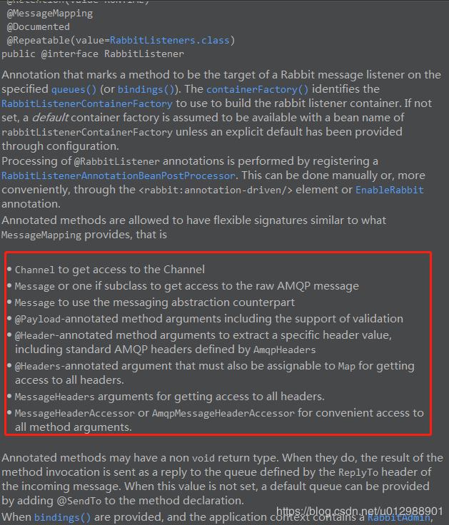

# RabbitMQ与SpringBoot的整合使用
会实现设置confirm和return回调确认，并且会对 "Only one ConfirmCallback is supported by each RabbitTemplate"和"Only one ReturnCallback is supported by each RabbitTemplate"出现的原因做出说明并给出相应的解决办法。

spring-rabbitmq模块中已经说过，xml中的那些`<rabbit:xxx>`标签对应的其实就是Spring提供的一些类，比如：CachingConnectionFactory、RabbitAdmin、RabbitTemplate
、MessageListenerContainer。。。。。。RabbitMQ与SpringBoot整合用的是spring-boot-starter-amqp，我们只需要在配置文件中配置一下，通过自动装配就可以自动创建我们需要的Bean。

## 工程说明
项目采用maven构建，springboot-rabbitmq 是parent工程，下面有三个module：
springboot-rabbitmq-common工程里面就定义了一个Order类；
springboot-rabbitmq--producer 和 springboot-rabbitmq-consumer 分别是消息生产者和消费者，二者都依赖 springboot-rabbitmq-common 工程。

### 消费者
#### 程序声明交换机、队列、绑定的方式主要有两种：
- 通过@Bean注解的方式；
- 通过 @RabbitListener(bindings = @QueueBinding( ...... ))，主要用到了@QueueBinding、@Queue、@Exchange这几个注解，用于声明绑定、队列和交换机。

#### 消费消息主要有两种方式：

##### 1、通过消息监听容器MessageListenerContainer：
下面代码中被我注释掉了的SimpleMessageListenerContainer
就是一种实现，我们通过消息监听容器可以设置消费者签收模式、消费者标签策略、消息转换器、并行消费数量、预抓取数量、异常处理。。。。。。当然，前面的这些设置我们也可以通过在application中配置，由SpringBoot的自动装配功能帮我们自动创建。还有一点，就是这个容器可以同时监听多个队列，对多个队列进行统一设置处理。

##### 2、另一种就是通过注解@RabbitListener和@RabbitHandler
@RabbitListener可以加在类或者方法上，用于标注当前类或方法是一个消息监听器，一般结合@RabbitHandler进行使用。@RabbitListener(queues = "") 也可以指定多个队列进行消费。

@RabbitListener(containerFactory="")注解中还有一个关键的属性containerFactory，containerFactory是消息监听容器工厂，如果不指定会使用默认的（这个根据配置spring.rabbitmq.listener.simple/direct决定），其生产MessageListenerContainer，设置的属性也差不多（消费者签收模式、消费者标签策略、消息转换器、并行消费数量、预抓取数量、异常处理。。。。。。）

使用这两个注解的消息处理方法是通过MessageConverter转化的，可以通过RabbitListenerContainerFactory 去设置我们自定义的消息转换器，下面代码中有个被我注释掉的方法中就定义了一个SimpleRabbitListenerContainerFactory，然后可以通过@RabbitListener(containerFactory="自定义消息监听容器bean名称")的方式指定使用我们自己的containerFactory。

消息的 content_type 属性表示消息 body 数据以什么数据格式存储，接收消息除了使用 Message 对象接收消息（包含消息属性等信息）之外，还可直接使用对应类型接收消息 body 内容，但若方法参数类型不正确会抛异常：
- application/octet-stream：二进制字节数组存储，使用 byte[]
- application/x-java-serialized-object：java 对象序列化格式存储，使用 Object、相应类型（反序列化时类型应该同包同名，否则会抛出找不到类异常）
- text/plain：文本数据类型存储，使用 String
- application/json：JSON 格式，使用 Object、相应类型

消费者代码示例中，我写了两个消费方法comsumeA(@Payload Order order,Channel channel,@Headers Map<String, Object> headers)、comsumeB(Message message, Channel channel)，分别通过Message、@Payload注解结合Order类接收的消息内容，另外我们还可以根据消息的内容将消费者方法定义为类型这样的：comsumeC(String msg)、comsumeD(Object msg)、comsumeE(byte[] msg)。。。。。。方法中的channel，header等参数都是可选的，可以根据自己的需求进行添加。如果英语好一点，可以看下@RabbitListener的说明
\

### 生产者
生产者工程结构如下：其中ConfirmCallBackHandler和ReturnCallBackHandler是用来处理生产者的confirm和return回调的，为了区分命名分别用了A、B结尾，其实里面的内容除了打印的日志有点区别，其他都一样；
ProducerApplication是启动类；
ProducerRabbitConfig是生产者的配置相关；
RabbitSender是发送消息的封装。

可以看到定义了两个RabbitTemplate，一个是单例的，另一个是多例的。可能你看到这有点迷惑，为什么要定义两个Bean，而且为什么还有一个是多例的呢？

在回答这个问题之前，我们先说一下RabbitTemplate设置confirm和return回调的方法源码：我们看到setConfirmCallback() 和setReturnCallback()都只能设置一次，否则就会报异常：Only one ConfirmCallback is supported by each RabbitTemplate，Only one ReturnCallback is supported by each RabbitTemplate
```
public void setConfirmCallback(ConfirmCallback confirmCallback) {
	Assert.state(this.confirmCallback == null || this.confirmCallback == confirmCallback,
			"Only one ConfirmCallback is supported by each RabbitTemplate");
	this.confirmCallback = confirmCallback;
}
 
public void setReturnCallback(ReturnCallback returnCallback) {
	Assert.state(this.returnCallback == null || this.returnCallback == returnCallback,
			"Only one ReturnCallback is supported by each RabbitTemplate");
	this.returnCallback = returnCallback;
}
```
而解决这个问题的办法有两种：
- 将RabbitTemplate设置为单例,并设置两个回调方法，这样所有采用此RabbitTemplate发送消息的都会应用这两个回调，有些我们不想设置confirm的地方也会触发该回调函数，使用方面不够灵活
- 将RabbitTemplate设置为多例,每次使用RabbitTemplate都通过applicationContext.getBean()的方式获取，这样每次获取到的都是一个新的RabbitTemplate
实例，发送消息时根据业务需要自己添加相应的回调方法，相对来说更加灵活一点

定义两个RabbitTemplate的目的是为了演示上面的两种解决办法.

然后我们在看一下RabbitSender类：里面两个发送的方法，分别使用了单例和多例的RabbitTemplate，并且多例的RabbitTemplate也设置了另外的两个confirm和return的回调实现

#### 测试发布消息在`ProducerApplicationTests`中