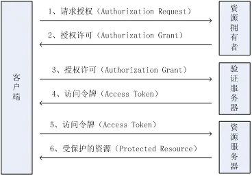
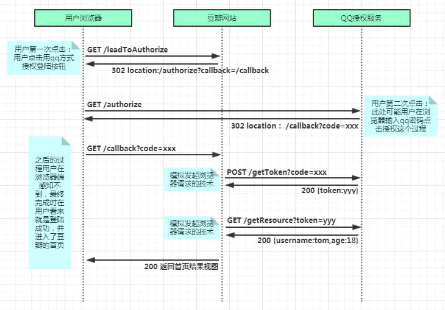

# shiro
关于shiro+springboot的集成使用，见模块shiro-springboot

# oauth2
OAuth2.0 是一个开放标准，允许用户让第三方应用访问该用户在某一网站上存储的私密的资源（如照片，视频，联系人列表），而不需要将用户名和密码提供给第三方应用。OAuth允许用户提供一个令牌，而不是用户名和密码来访问他们存放在特定服务提供者的数据。每一个令牌授权一个特定的网站在特定的时段内访问特定的资源。这样，OAuth让用户可以授权第三方网站访问他们存储在另外服务提供者的某些特定信息，而非所有内容。

比如你登录简书，但是你没有注册简书账号，这个时候呢，你可以选择 使用QQ登录，或者微信登录等方式。

## OAuth2.0四个角色
- 资源拥有者(resource owner)：比如你的信息是属于你的。你就是资源的拥有者。
- 资源服务器（resource org.lwq.oauth2.server）：存储受保护资源，客户端通过access token请求资源，资源服务器响应受保护资源给客户端。
- 授权服务器（authorization org.lwq.oauth2.server）：成功验证资源拥有者并获取授权之后，授权服务器颁发授权令牌（Access Token）给客户端。
- 客户端（client）：第三方应用，其本身不存储资源，而是资源拥有者授权通过后，使用它的授权（授权令牌）访问受保护资源，然后客户端把相应的数据展示出来/提交到服务器。“客户端”术语不代表任何特定实现（如应用运行在一台服务器、桌面、手机或其他设备）。

实例：
- 资源：上例中的QQ昵称，头像等数据。
- 资源拥有者：即QQ用户，也就是我。
- 客户端：要获取资源的第三方应用，即简书网站。
- 资源服务器：资源存放的服务器，我QQ的头像，昵称放在腾讯QQ的服务器上，即QQ服务器，客户端要资源找他。
- 授权服务器：客户端要获取资源，先要通过认证，负责认证的家伙就是授权服务器，上例中授权服务器也在QQ那边，因为只有QQ能验证你输入的用户名密码对不对。

## oauth2.0认证的流程
流程图：

上面讲的例子的详细步骤图：

## 代码说明
把授权服务器和资源服务器整合在一起实现。统称服务端

分oauth2客户端和服务端两个项目

### 客户端
1. 通过用户在浏览器授权获取第三方平台的信息，客户端向服务端发起请求授权（AuthAccessController getCode()方法）
2. 通过1指定的重定向URL，server端重定向进入客户端，客户端通过获取的授权code向服务端发起请求访问令牌的请求（AuthAccessController getAccessToken()方法）
3. 服务端返回（也可以重定向）生成的accessToken，客户端通过该accessToken向服务端发起请求获取受保护的资源（AuthAccessController getUserInfo()方法）

### 服务端
1. 接收客户端的授权请求，并验证是否登录，若未登录，引导到登录页面进行登录，登录成功后，生成授权码code，并重定向到客户端回调URL（AuthorizationController authorize()方法）
2. 接收客户端携带刚刚授权的code发起的请求访问令牌的请求，验证code及其他身份信息，通过，生成accessToken（并缓存），返回给客户端（AccessTokenController token()方法）
3. 接收客户端携带刚刚授权的accessToken发起的请求资源的请求，验证accessToken，通过，将资源查出，返回给客户端（UserInfoController userInfo()方法）