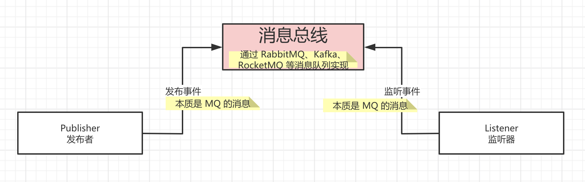
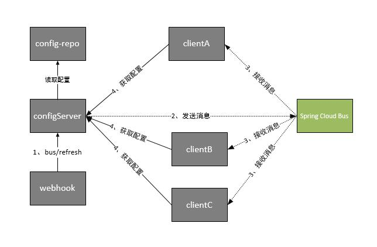

Example demonstrating how to use Spring Cloud Bus RocketMQ

Spring Cloud Bus 在 Spring 事件机制的基础之上进行拓展，结合 RabbitMQ、Kafka、RocketMQ 等等消息队列作为事件的**“传输器”**，通过发送事件（消息）到消息队列上，从而广播到订阅该事件（消息）的所有节点上。最终如下图所示：

Spring Cloud Bus做配置更新步骤如下:
1. 提交代码触发post给Server端发送bus/refresh
2. Server端接收到请求并发送给Spring Cloud Bus
3. Spring Cloud bus接到消息并通知给其它客户端
4. 其它客户端接收到通知，请求Server端获取最新配置
5. 全部客户端均获取到最新的配置

如下图所示：

