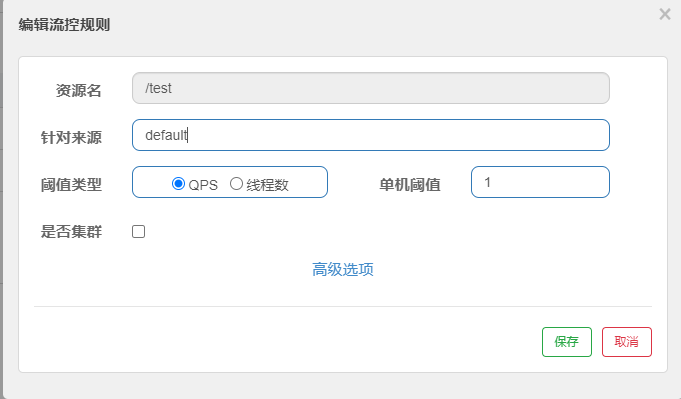
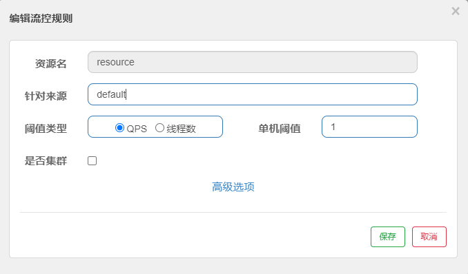

sentinel

## 接入限流埋点
1. 默认对所有http服务提供了限流埋点。因此可以直接配置http接口相对路径，如下图（对应接口/test）

2. 可以通过 @SentinelResource，如下图（对应接口/hello）

3. 可以通过 @SentinelRestTemplate，直接对RestTemplate请求的服务进行埋点

## 配置限流规则
1. 代码配置
2. 控制台配置
3. ReadableDataSource动态规则的扩展实现
    - 目前支持file(支持json、xml格式), nacos, zk, apollo，redis 这5种类型

## 自定义限流处理逻辑
1. 默认（URL）限流异常处理：
直接返回 "Blocked by Sentinel (flow limiting)"。如果需要自定义处理逻辑，需要实现UrlBlockHandler的blocked方法(在最新版本中， 似乎没有 UrlBlockHandler 接口， 尝试通过 实现 BlockExceptionHandler 接口，实现 handle 函数，也能实现该功能)
2. 使用 @SentinelResource 注解下的限流异常处理。默认500异常
如果需要自定义处理逻辑，填写 @SentinelResource 注解的 blockHandler 属性（针对所有类型的 BlockException，需自行判断）或 fallback 属性（针对熔断降级异常），注意对应方法的签名和位置有限制(传参与返回必须一致)
3. 使用 @SentinelRestTemplate 注解下的限流异常处理。默认：RestTemplate request block by sentinel
如果自定义：则填写 @SentinelRestTemplate 注解的 blockHandler 属性或 fallback 属性

## 规则分配
1. 流控
2. 降级
3. 热点
4. 系统
5. 授权
